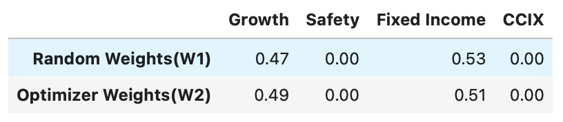
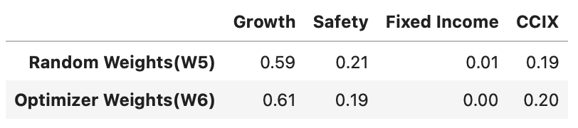
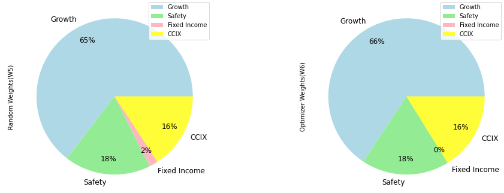
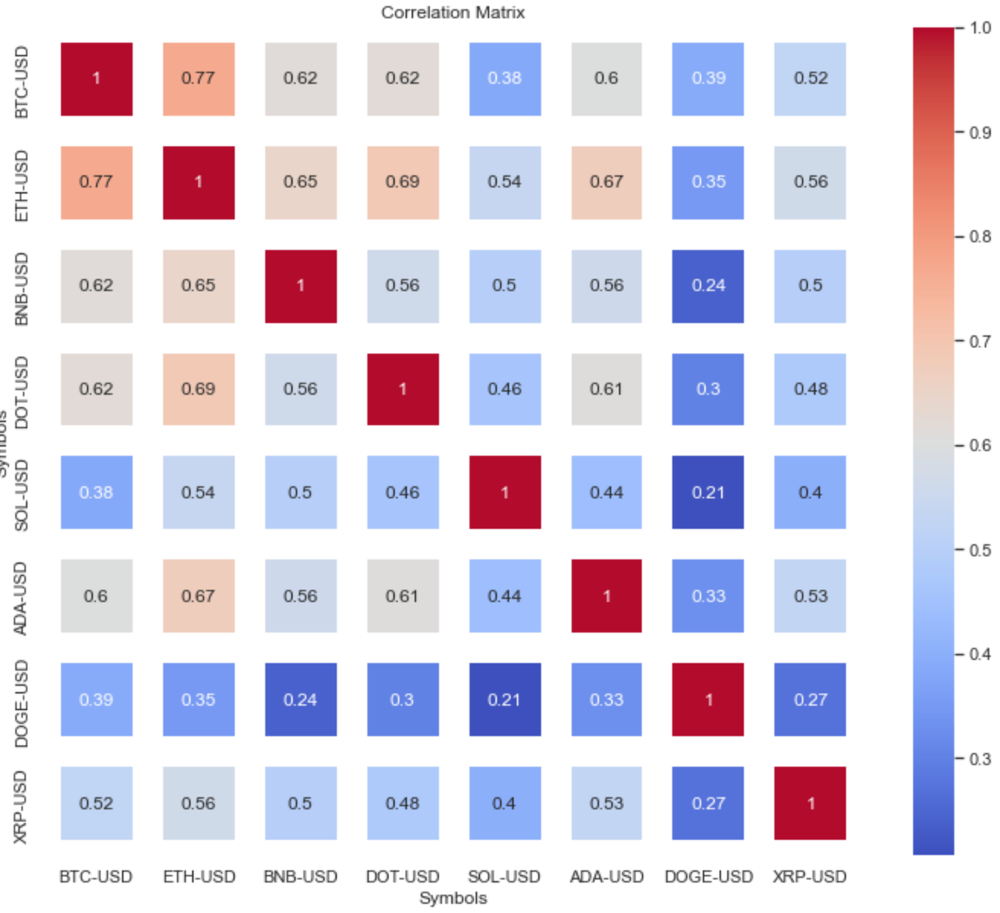
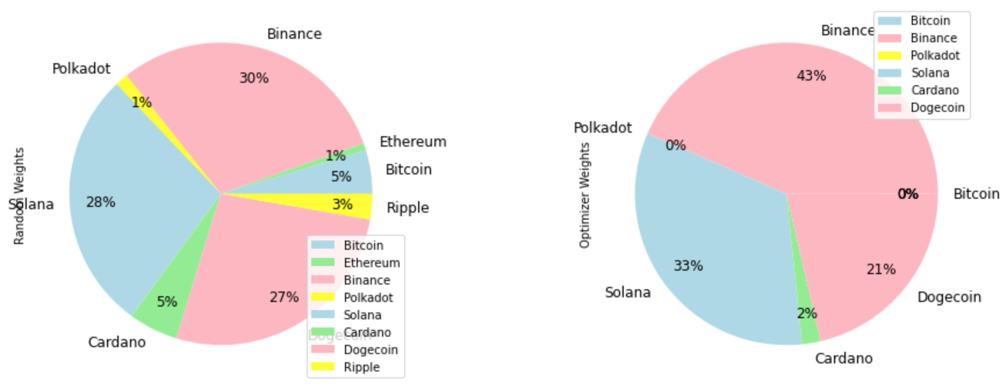
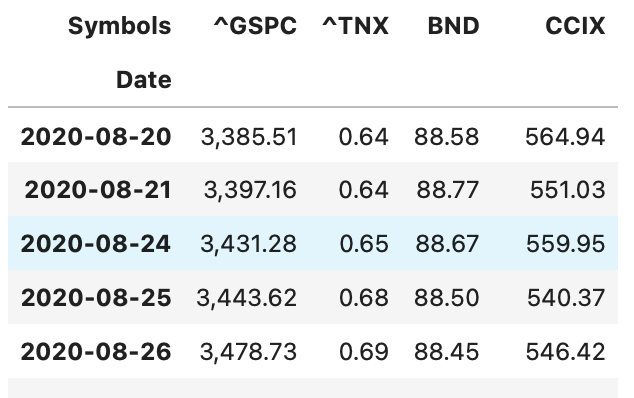
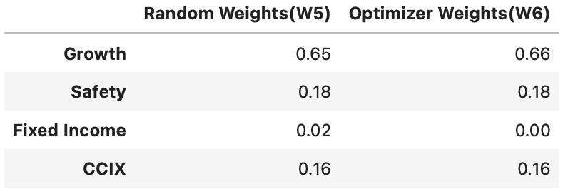
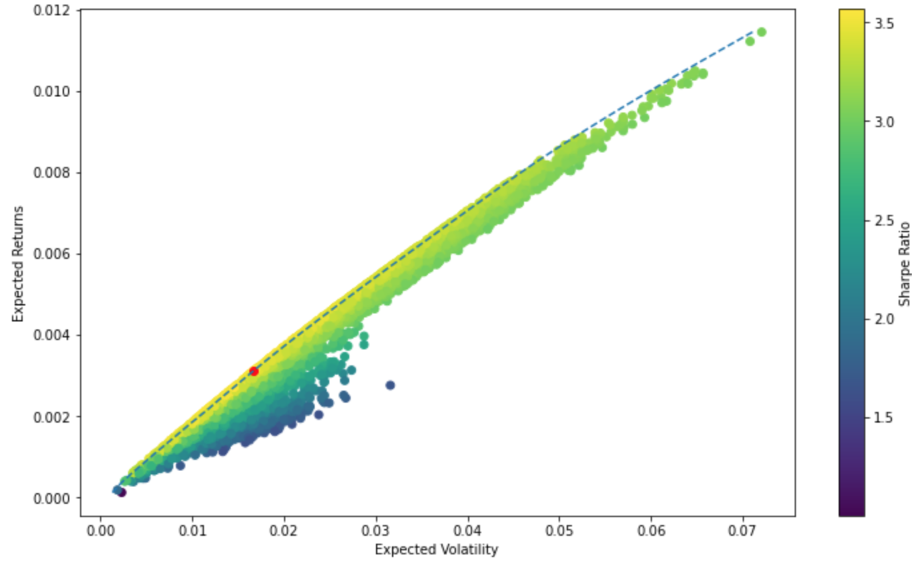
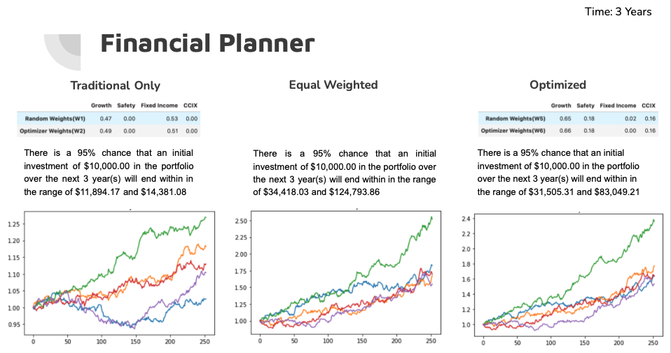

# Optimum Portfolio Allocation for Contemporary Investment Strategies

## Creating a balanced portfolio with traditional assets and crypto assets
Team 3: Daria, Gwen, Kahlid, Nitin, tiyub  
FinTech Bootcamp - University of Toronto

## Primary Purpose
Assuming a certain level of inherent risk, we attempt to create a balanced portfolio with traditional and crypto assets

- How people with low income can create a portfolio with crypto?  
- What is the Optimum portfolio, traditional training strategies combined with crypto holdings?
---

## Means of conducting data research
**Metrics being used** - LOG Returns and DataSet Statistics 

**Risk Metrics** - Standard Deviation, Covariance, Correlation, Sharpe Ratio

**Datasets** - datasets and crypto selection

---

## Proxies for broad asset classes
**Growth** - S&P 500 

**Fixed Income** - BND - Vanguard Total Bond Market Index Fund ETF

**Safety** - TNX - Treasury Yield 10 Years

**Crypto** - CCIX Index created as a proxy, a combination of 'BTC-USD', 'ETH-USD', 'BNB-USD', 'DOT-USD', 'SOL-USD', 'ADA-USD','DOGE-USD','XRP-USD']

**References:** Past homework assignments, API and PyViz

## Timeframe/Horizon
- 10 Years for Traditional Asset Classes
- 3 Years combined for Cryptocurrencies

---

## Methods of Computation

1. **Random Generation** of Portfolio Weights (10k combinations) using Monte Carlo simulations

2. **SciPy Portfolio Optimizer** - by minimizing negative Sharpe Ratio

The two methods being used are used to compare and test allocation outputs

## Summary of Computed Allocations
 
# Creating a balanced portfolio with traditional assets and crypto assets

[View the presentation slides](https://docs.google.com/presentation/d/1PZbbSxpeOFjUhglsxseEhj90RuiEs8e-7NcdnE-z-YE/edit#slide=id.g10af8fe7a79_0_5)

Team 3  
Daria, Gwen, Kahlid, Nitin, tiyub  

### Primary Purpose
Assuming a certain level of inherent risk, we attempt to create a balanced portfolio with traditional and crypto assets.  

Our results show a possible Optimum portfolio, combining traditional asset classes with crypto holdings as a balanced portfolio.

### Means of Conducting Data Research  
#### Assuming inherent risk
- What metrics are we using - LOG Returns and DataSet Statistics
- Which risk metrics make sense - Standard Deviation, Covariance, Correlation
- Datasets - Find the datasets and decide which crypto we will be including
  <ol type="a">
    <li>Proxies for broad asset classes</li>
      <ol>
        <li>Growth - S&P 500</li>
        <li>Fixed Income - BND - Vanguard Total Bond Market Index Fund ETF</li>
        <li>Safety - TNX - Treasury Yield 10 Years</li>
        <li>Crypto - CCIX [Index created as a proxy, a combination of 'BTC-USD', 'ETH-USD', 'BNB-USD', 'DOT-USD', 'SOL-USD', 'ADA-USD','DOGE-USD','XRP-USD']</li>
      </ol>
  </ol>

References: Past homework assignments, API and PyViz

### Cleaning Process
- Drop NAs using the drop.na function
- Inner Join based on common index to omit zero values
- Used test to get NULL value

### New Libraries

yfinance as yf  

pandas_datareader as pdr  

import plotly.offline as pyo

## Data

Sources  
Pandas datareader  
yahoo finance

  
  

  

  

The CCIX was created by applying the Random Generation and SciPy methods to determine the optimum mix of Cryptocurrencies

---

# New Combined Dataset for Asset Classes

## Optimum Allocation for Traditional + Crypto Asset Classes

---

# Modern Portfolio Theory - Efficient Frontier for Optimum Allocation
The plot determines the possible optimum allocations with a Risk vs Return Relationship. The 'Red Dot' marks the maximum return for lowest risk. All allocations around the Efficient frontier curve (dash-line) represents the optimum allocation for Risk vs Return.

---
# Financial Planner

**Return estimator**

Using historical returns and Monte Carlo Simulations, the estimator constructs a possible outcome for an initial investment of $10,000, at at 95% confidence interval, using model portfolio weights.

---
# Limitations

1. Individual Proxies for Asset Classes
2. Volume of Data - 3 Years for Crypto and 10years for Traditional 
3. Financial planner estimate - assuming that history repeats itself [historical returns calculated] 
4. Selection of Cryptos based on Top 10 Market Cap
 ---

 # Scope

By addressing the limitations, and possibly using machine learning and NLP, the scope can be expanded to predictive analysis of optimum portfolio allocation. The average investor who is not familiar with asset picking, can find a balance between risk and return using the findings, and apply a strategic and systematic investment model to pariticipate in contemporary trading strategies.

---
# Dashboard

A panel dashboard to browse the various charts and findings

<!--| Task         | Objective | Allocation |
|--------------|:-----|:-----------|
| Download Dataset | | Nitin |
| Data cleanup Explore, clean and reformat | | Nitin |
| Data Analysis | |  Nitin |
| Scenarios/Portfolios | Only crypto Only stocks and bonds Combined | |
| Charts Looking at BTC | | |
| Charts Stocks and bonds | | |
| ~~~Streamlit~~~ | | |
| Presentation [link](https://docs.google.com/presentation/d/1PZbbSxpeOFjUh)| Accompanied by Jupyter Notebook Discussing Implications of | Gwen |
| | Findings Graphics / Visualizations Screen recordings of notebook | |
| MD README | | tiyub |
| .ipynb slideshow | | tiyub |-->
 

# Presentation Link
https://docs.google.com/presentation/d/1PZbbSxpeOFjUhglsxseEhj90RuiEs8e-7NcdnE-z-YE/edit#slide=id.g10af8fe7a79_0_5

## References

Disclose
    
<!-- 

Disclose
     -->

#### Listing  

<a id="ref001">1</a> Andrianto, Y., Diputra, Y. (2017-09-30). The Effect of Cryptocurrency on Investment Portfolio Effectiveness. Retrieved from [Journal of Finance and Accounting - PDF in this repo.](https://github.com/1ightray/Team3UofT/blob/main/resources/The%20Effect%20of%20Cryptocurrency%20on%20Investment%20Portfolio%20Effectiveness.pdf)

<a id="ref002">2</a> Aroussi, Ran (2021-12-30). Download market data from Yahoo! Finance's API. Retrieved from [pypi.org](https://pypi.org/project/yfinance/).

<a id="ref003">3</a> Speck, Matthew (2017-05-16). Presenting Code Using Jupyter Notebook Slides. Retrieved from [medium.com](https://medium.com/@mjspeck/presenting-code-using-jupyter-notebook-slides-a8a3c3b59d67).

<a id="ref004">4</a> Roepke, Mark (2019-06-05). Tips for Creating Slideshows in Jupyter. Retrieved from [markroepke.me](https://www.markroepke.me/posts/2019/06/05/tips-for-slideshows-in-jupyter.html).

### Misc.

Disclose
  
 
<a id="ref100">100</a> Installed package of scikit-learn can be accelerated using scikit-learn-intelex.  

[Details](https://intel.github.io/scikit-learn-intelex)
<blockquote style="border-left: 0px solid #ccc; color: rgb(88, 166, 255);">

from OS command line interface

 
For example:

    $ conda install scikit-learn-intelex
    $ python -m sklearnex my_application.py

</blockquote>

<a id="ref101">101</a> Streamlit turns data scripts into shareable web apps in minutes. All in Python. All for free. No front‑end experience required. [streamlit.io](https://streamlit.io)

<a id="ref102">102</a> Kiao, Ue. Clone Conda Environment (3 techniques). Retrieved from [opengenus.org](https://iq.opengenus.org/clone-conda-environment/).

<a id="ref103">103</a> Kiao, Ue. Delete Conda Environment (7 commands). Retrieved from [opengenus.org](https://iq.opengenus.org/delete-conda-environment/).

<a id="ref104">104</a> Conda user guide: Managing environments. Retrieved from [docs.conda.io](https://docs.conda.io/projects/conda/en/latest/user-guide/tasks/manage-environments.html).

<a id="ref105">105</a> Installed package of scikit-learn can be accelerated using scikit-learn-intelex.  

[Details](https://intel.github.io/scikit-learn-intelex)
<blockquote style="border-left: 0px solid #ccc; color: rgb(88, 166, 255);">

from OS command line interface

 
For example:

    $ conda install scikit-learn-intelex
    $ python -m sklearnex my_application.py

</blockquote>

